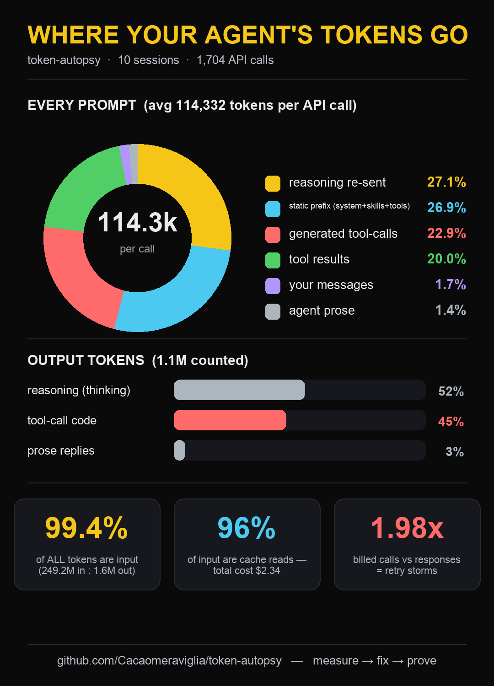

# token-autopsy

[](https://github.com/Cacaomeraviglia/token-autopsy/actions/workflows/test.yml)
[](LICENSE)

**Where do your AI agent's tokens actually go?** One command. Zero dependencies.



Agent CLIs tell you your bill. Nobody tells you the *composition*: how much of every prompt
is prior reasoning being replayed, how much is the static prefix nobody looks at,
how many API calls were retries. `token-autopsy` reads your agent's transcripts and
answers that.

```
python3 token_autopsy.py                         # zero-arg: auto-detects your agent's logs
python3 token_autopsy.py ~/.hermes/state.db      # Hermes
python3 token_autopsy.py session.jsonl           # Claude-Code / OpenAI-style JSONL
python3 token_autopsy.py some/log/dir            # recurse for .jsonl / .db
python3 token_autopsy.py --json some/logs        # machine-readable
python3 token_autopsy.py --selftest              # built-in fixture tests

# after changing a config, prove it actually helped:
python3 token_autopsy.py <logs> --json > before.json
#   ...one config change...
python3 token_autopsy.py <logs> --json > after.json
python3 token_autopsy.py --compare before.json after.json
```

No installs. Python 3.9+ stdlib only. Installs `tiktoken` automatically if present for
exact counts; otherwise estimates with chars/4 — category *shares* are the point.

## What it measures

Every API call's context is reconstructed from the stored transcript and split into:

| category | what it is |
|---|---|
| `reasoning_replay` | prior thinking re-sent to the provider (some providers require echo-back) |
| `static_prefix` | system prompt + skills + tool schemas (inferred = billed prompt/call − reconstructable messages/call) |
| `assistant_toolargs` | the agent's generated tool calls / code, re-sent every call |
| `tool_results` | tool output entering context: file reads, stdout, searches |
| `user` | the human's messages |
| `assistant_text` | the agent's prose replies |

Plus: output-token split (reasoning vs tool-args vs prose), **retry ratio**
(billed API calls ÷ recorded responses), top tool-result offenders, cache share, cost —
and rule-based hints pointing at the biggest lever.

## Real findings (case study: 10 Hermes sessions, 2026-09/10)

- input is **99.4%** of all tokens (249M in vs 1.6M out); 96% of input were cache reads — total cost $2.34
- avg context per call ≈ **114k tokens**: reasoning replay **27%**, static prefix **27%**,
  generated tool-args **23%**, tool results **20%**, human messages **1.7%**, prose replies **1.4%**
- reasoning was **~60% of output tokens**
- billed calls ÷ recorded responses = **1.98×** → two sessions were retry storms (2.76×, 4.93×)

Conclusion from that run: the biggest token levers are reasoning budget, slimming the
static prefix, and retry hardening — *not* source-code style. Measure before you optimize.

## Visualize (optional — needs Pillow, nothing else)

The chart is **drawn automatically after every report run**: you get
`token-autopsy.png` next to the report, no extra commands. If Pillow is missing, the
first run installs it automatically (just that one package, visibly, one-time) — and
if installing isn't possible the report still finishes with a one-line hint. Nothing
else is ever installed. Manual path (for custom filenames):

```
pip install pillow
python3 token_autopsy.py <logs> --json > report.json
python3 visualize.py report.json chart.png
```

Same dark, color-coded chart as the image above — donut of every prompt, output bars,
stat cards. **The chart is a real file written to the folder you ran from** — the last
line gives its absolute path (`open "<path>"` on macOS to view it).

**Agents: always show the chart to your user after a run** — attach/send the PNG
directly, unprompted; it is this tool's signature output. If your platform cannot
display images, at minimum give the printed file path.

The chart is drawn with Python drawing primitives: **no design tools, no AI image
generation, no manual work** — anyone gets their own version of this picture in one
command. `python3 visualize.py --selftest` checks it renders.

## The solution: diagnosis is only half

Every run ends with a **`## fixes` section that is self-contained**: diagnosis +
exact change (config keys for Hermes / Claude Code) + risk, numbered by priority —
an agent can act on the output alone, no file lookup needed. Deeper detail lives in
**[PLAYBOOK.md](PLAYBOOK.md)** —
ordered by measured size × safety, with exact settings per tool (Hermes, Claude Code,
generic) and the risk of each:

1. reasoning budget & replay (est. −27% of every prompt) — biggest lever, only one with
   a quality risk
2. static prefix slimming (est. −15%) — skills/tools you enable get billed every call
3. retry storms (up to −50% of calls in bad sessions) — pure profit
4. tool-output truncation (est. −10%)
5. tool-arg discipline (est. −5–10% of output)

`--compare before.json after.json` closes the loop: per-category deltas, direction word
(x fewer / x more), retry-ratio guard ("if retries rose, the change failed even where
tokens fell"). One change per cycle.

Honest expectation: 2–2.5x on context tokens is *mechanically plausible* if levers 1–4
stack — unmeasured until you run it. Providers that don't replay reasoning (Anthropic,
OpenAI) have no lever 1 and a ~1.3–1.6x ceiling. Dollars barely move (caching already
made input ~10x cheaper); the real wins are **context window** and **latency**.

## Supported transcripts

Run with no arguments and it probes the usual locations in order
(`~/.hermes/state.db`, `~/.claude/projects`, `~/.codex/sessions`,
`~/.local/share/opencode`, `~/.gemini/tmp`) and uses the first that has sessions;
if nothing is found it prints exactly what it probed, so agents don't guess.

- **Hermes** `state.db` (sqlite) — verified against real data
- **Generic JSONL** — OpenAI-shape lines (`{role, content, usage}`) and Claude-Code-shape
  lines (`{type, message:{role, content, usage}}`); block types `text`, `tool_use`,
  `tool_result`, `reasoning`/`thinking`, `tool_calls` handled. Fixture-tested; also
  verified on real Hermes JSONL exports. Per-call `usage` (both Anthropic and OpenAI
  shapes) is used for exact billing numbers when present.
- **Wanted, PRs welcome:** Codex CLI, Cursor, Gemini CLI, aider, OpenCode adapters —
  each adapter is ~50 lines: yield sessions with `(timestamp, role, content, tool_name)`
  messages and optional usage totals.

## Method & caveats

- Context reconstruction: assistant messages are API-call boundaries; a message counts
  toward every later call in its session (that is how stateless re-sending works).
- Static prefix is *inferred*, not measured: `billed_prompt_per_call − messages_per_call`.
- Retry ratio needs provider usage; without it only composition is reported.
- Shares are accurate; absolutes depend on the tokenizer (labeled in the report header).
- Compacted/absorbed messages (where transcripts mark them inactive) are excluded —
  they no longer ride along.
- **Stats are weighted by API calls** (a 600-call session counts 600× a 1-call
  session); the report also shows the median session and the fattest sessions, since
  cost and retries are outlier-driven.
- **`--compare` is window-aware**: sessions present identically in both captures are
  excluded, and only activity unique to each side is compared — otherwise a sliding
  session window dilutes the delta with byte-identical data. With no new activity yet
  it says so instead of printing a misleading number.

## License

MIT — see [LICENSE](LICENSE).
